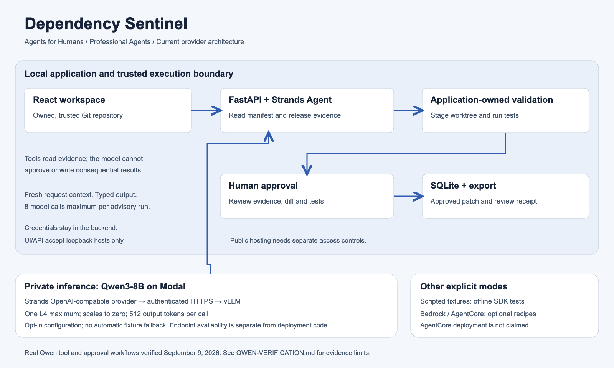
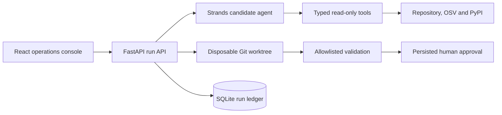

# Dependency Sentinel

[Connect a model](docs/ACTIVATION.md) · [Verified Qwen workflows](docs/QWEN-VERIFICATION.md) · [Submission checklist](docs/RELEASE-CHECKLIST.md)

For the real-input, local-first workspace and its verified limits, see [Local product workflow](LOCAL-PRODUCT.md).

Dependency Sentinel is a maintenance agent for the Professional Agents track of the Agents for Humans Hackathon. It selects one affected Python dependency, checks a proposed fixed release against advisory and package metadata, stages the upgrade in a disposable Git worktree, runs validation and pauses for a human decision.

It never edits the selected source checkout.


## Why this project

Routine dependency upgrades combine security research, release verification, source changes and test execution. Automating all of that directly in a maintainer's checkout creates unnecessary risk. Dependency Sentinel separates reasoning from execution and makes the boundary visible:

1. A Strands agent selects one candidate using typed read-only tools.
2. Deterministic application code verifies advisory and release evidence.
3. A disposable worktree receives the proposed manifest and lockfile changes.
4. A fixed command allowlist runs validation with a timeout and secret redaction.
5. The run pauses at a persisted approval gate.
6. Approval records the reviewed result. It does not silently modify the source checkout or publish anything.

Selection, staging and validation use one captured Git commit, even if the source branch later moves. Dirty input is rejected. Changes to tracked files during validation invalidate the result. After approval, the server can export both the patch and a review receipt containing evidence, commands, source revision, approval time and the patch's SHA-256.

Receipts establish consistency of a local saved record, not a signed attestation. They contain local paths and test output; review them before sharing. Older runs without complete provenance remain viewable but cannot export.

## One-command judging demo

Prerequisites: Python 3.11+, uv, Node.js 20.19+ (22.12+ recommended), npm, Git and Bash.

```bash
python3 scripts/demo.py
```

Open `http://127.0.0.1:8000`. This installs locked dependencies, builds the frontend, and serves the UI and API from one local process. It forces scripted fixture mode even if your environment enables AWS, uses temporary demo data, and removes that data when stopped with Ctrl+C. First-time dependency installation needs internet access; the demo itself does not call a model. Use `--port 8201` to avoid a port conflict. After installation, `--skip-install` reuses dependencies.

This command runs the scripted model. Real Qwen3-8B inference through Strands was verified on September 9; see [the workflow evidence](docs/QWEN-VERIFICATION.md). The private Modal endpoint was then stopped at the owner's request. Bedrock and AgentCore remain unverified. A judge must not be told that this free scripted run demonstrates live inference.

## Real model setup

The backend supports explicit Bedrock, AgentCore, or OpenAI-compatible configuration, with no silent fallback to fixtures. [Qwen on Modal](docs/MODAL.md) documents the tested provider, authentication, spending controls and cold-start procedure. [External model configuration](docs/EXTERNAL-MODELS.md) also supports a compatible endpoint from another authorized provider.

After configuring the ignored `backend/.env`, run:

```bash
backend/.venv/bin/python scripts/run.py check
backend/.venv/bin/python scripts/model_probe.py --allow-paid-requests --warm-only
backend/.venv/bin/python scripts/model_workflow_smoke.py --allow-paid-requests
backend/.venv/bin/python scripts/run.py serve --port 8000 --allow-paid-requests
```

The last three commands require an available funded endpoint. Do not run them against a deliberately stopped service or put provider credentials in the frontend. Public hosting and free real-model access for judges still need to be arranged; bring-your-own paid credentials is not a completed judge-access plan.

## Architecture



[Editable SVG](docs/architecture-current.svg). Use this PNG for the submission attachment.



The default fixture mode is deterministic and requires no AWS account. Live mode uses a Strands `Agent` with Bedrock or an OpenAI-compatible model. Advisory/release evidence has its own explicit fixture/live setting.

## Reproducible local demo

Prerequisites: Git, Python 3.11+, [uv](https://docs.astral.sh/uv/) and Node.js 20+.

Create the standalone vulnerable fixture repository:

```bash
./scripts/create_demo_repository.sh
```

The script prints the absolute repository path. The API command below explicitly allows that demo directory and keeps worktrees under the ignored backend data directory.

Start the API:

```bash
cd backend
uv sync --frozen --dev
DEPENDENCY_SENTINEL_FIXTURE_MODE=true DEPENDENCY_SENTINEL_EVIDENCE_MODE=fixture DEPENDENCY_SENTINEL_REPOSITORY_ROOT=../demo-repositories uv run uvicorn app.main:app --reload --host 127.0.0.1 --port 8001
```

In another terminal, start the interface and pass the path printed by the setup script:

```bash
cd frontend
npm ci
VITE_DEMO_REPOSITORY=/absolute/path/to/demo-repositories/vulnerable-python-project npm run dev -- --host 127.0.0.1 --port 5179
```

Open `http://127.0.0.1:5179`. The Vite proxy targets port 8001. Scan the controlled fixture and review the evidence, diff, validation output and exact approval gate. Only run validation for repositories you own and trust: their build and test code executes locally, and a worktree is not a security sandbox.

## Live Bedrock mode

The backend reads `backend/.env`, not a root `.env`. Set these values there or in the API process environment:

```dotenv
AWS_PROFILE=your-profile
BEDROCK_MODEL_ID=your-supported-model-id
DEPENDENCY_SENTINEL_AWS_REGION=us-east-1
DEPENDENCY_SENTINEL_FIXTURE_MODE=false
```

Model advice and evidence retrieval are separate settings. `DEPENDENCY_SENTINEL_EVIDENCE_MODE=live` uses OSV/PyPI; setting fixture mode to false alone does not enable live evidence. Verify current provider access and pricing first. Response limits do not create an account-wide billing cap or guarantee credits-only spend.

Live mode can use paid AWS services and public advisory APIs. Confirm your AWS budget and model access before enabling it. The current repository demonstrates Strands Agents SDK orchestration locally. It does not claim an Amazon Bedrock AgentCore deployment.

## API surface

- `POST /api/runs` starts an idempotent maintenance run
- `GET /api/runs/{run_id}` returns the persisted run
- `GET /api/runs/{run_id}/events` returns the ordered event ledger
- `GET /api/runs/{run_id}/events/stream` streams run events with SSE
- `POST /api/runs/{run_id}/approvals` records the exact approval or rejection
- `GET /api/runs/{run_id}/exports/patch` downloads the approved, validated patch
- `GET /api/runs/{run_id}/exports/receipt` downloads its bound JSON review receipt
- `GET /api/health` reports fixture and model configuration

## Verification

Backend:

```bash
cd backend
uv run pytest -q
uv run ruff check .
```

Frontend:

```bash
cd frontend
npm test -- --run
npm run build
```

Use the one-command demo for a browser walkthrough. There is no configured `npm run test:e2e` script. The automated suites cover the controlled fixture, path restrictions, idempotent approvals, validation failures and frontend loading/recovery states. Historical screenshots are not evidence of current live-provider access.

| Landing | Mobile landing | Approval console | Mobile evidence |
| --- | --- | --- | --- |
| [Desktop](docs/screenshots/landing-desktop.png) | [Mobile](docs/screenshots/landing-mobile.png) | [Desktop](docs/screenshots/desktop-approval.png) | [Timeline](docs/screenshots/mobile-timeline.png) and [approval](docs/screenshots/mobile-approval.png) |

## Hackathon technology and outstanding requirements

The free demo executes Strands with a scripted model, including tool dispatch and structured output. Real Qwen inference was verified with recorded advisory evidence and actual fixture tests. Live OSV/PyPI evidence is a separate verification gate. Bedrock and AgentCore remain optional alternatives. See [Qwen verification](docs/QWEN-VERIFICATION.md) and [AgentCore setup](docs/AGENTCORE.md).

The [qualification record](docs/QUALIFICATION.md) documents remaining publication and account requirements. The [architecture PNG](docs/architecture.png), [article draft](docs/BUILDER_POST.md) and [video outline](docs/DEMO_SCRIPT.md) exist locally; publication and the final Devpost record have not been verified for this revision. An unpublished draft earns no blog bonus.

## Safety properties

- Repository paths are canonicalized and constrained to an allowed root
- Symlink escapes and non-root paths are rejected
- The model receives read-only discovery tools only
- Source edits happen in a disposable Git worktree
- Validation uses a fixed executable allowlist and bounded runtime
- Stored command output is redacted for common secret formats
- Approval IDs, choices, run transitions and events are persisted
- Replayed run requests and approvals are idempotent

## Development disclosure

Himanshu Kumar is the solo entrant. Codex assisted implementation, testing and documentation; Claude Desktop assisted the landing-page implementation. Product decisions and submission responsibility remain with the entrant.

## License

Apache-2.0
