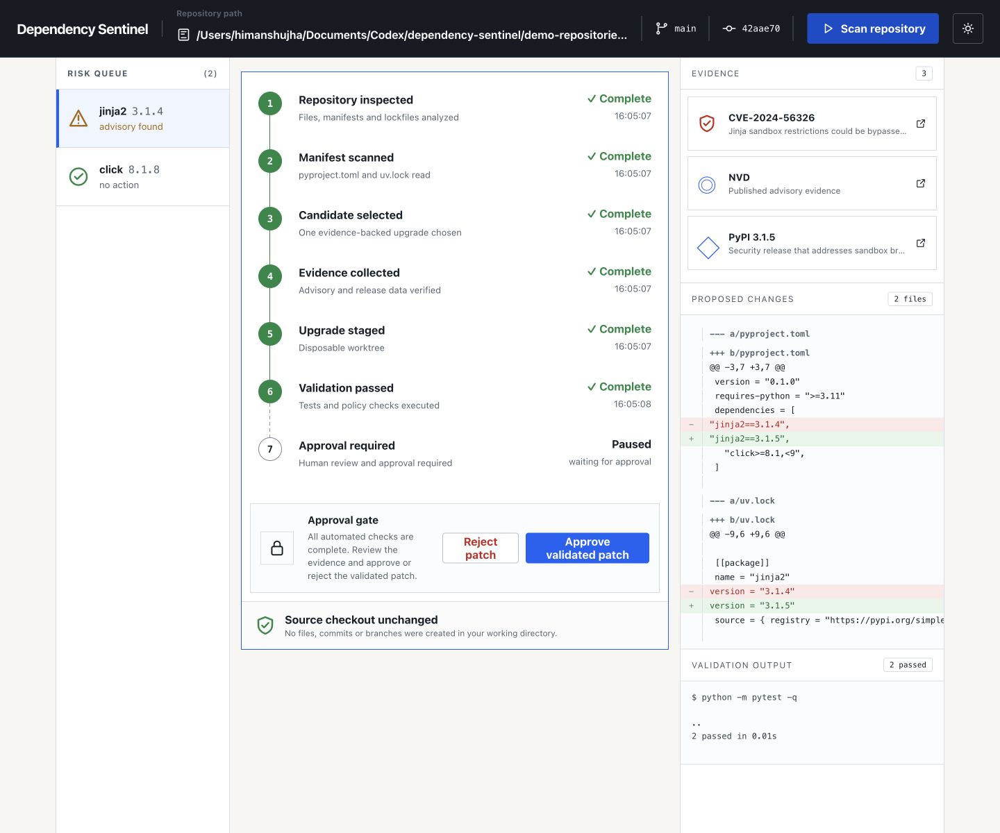
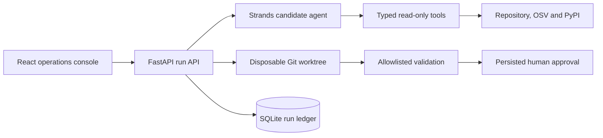

# Dependency Sentinel

Dependency Sentinel is an evidence-first maintenance agent for the Professional Agents track of the Agents for Humans Hackathon. It finds one vulnerable Python dependency, verifies the smallest fixed release, stages the upgrade in a disposable Git worktree, runs validation and pauses for a human decision.

It never edits the selected source checkout.



## Why this project

Routine dependency upgrades combine security research, release verification, source changes and test execution. Automating all of that directly in a maintainer's checkout creates unnecessary risk. Dependency Sentinel separates reasoning from execution and makes the boundary visible:

1. A Strands agent selects one candidate using typed read-only tools.
2. Deterministic application code verifies advisory and release evidence.
3. A disposable worktree receives the proposed manifest and lockfile changes.
4. A fixed command allowlist runs validation with a timeout and secret redaction.
5. The run pauses at a persisted approval gate.
6. Approval records the reviewed result. It does not silently modify the source checkout or publish anything.

## Architecture



The default fixture mode is deterministic and requires no AWS account. Live mode uses the same workflow with a Strands `Agent`, an Amazon Bedrock model, OSV advisory data and PyPI release data.

## Reproducible local demo

Prerequisites: Git, Python 3.11+, [uv](https://docs.astral.sh/uv/) and Node.js 20+.

Create the standalone vulnerable fixture repository:

```bash
./scripts/create_demo_repository.sh
cp .env.example .env
```

The script prints the absolute repository path. The default `.env.example` allows repositories under `demo-repositories/` and keeps temporary worktrees under `backend/data/workspaces/`.

Start the API:

```bash
cd backend
uv sync --dev
uv run uvicorn app.main:app --reload
```

In another terminal, start the interface and pass the path printed by the setup script:

```bash
cd frontend
npm ci
VITE_DEMO_REPOSITORY=/absolute/path/to/demo-repositories/vulnerable-python-project npm run dev
```

Open `http://127.0.0.1:5173`, scan the fixture and review the evidence, diff, validation output and exact approval gate.

## Live Bedrock mode

Set these values in the repository root `.env`:

```dotenv
AWS_PROFILE=your-profile
BEDROCK_MODEL_ID=your-supported-model-id
DEPENDENCY_SENTINEL_AWS_REGION=us-east-1
DEPENDENCY_SENTINEL_FIXTURE_MODE=false
```

`amazon.nova-micro-v1:0` is an on-demand text-model example listed in `us-east-1`; verify access in your own account before enabling live mode. The Bedrock client explicitly caps each response at 512 tokens to bound quota reservation and cost.

Live mode can use paid AWS services and public advisory APIs. Confirm your AWS budget and model access before enabling it. The current repository demonstrates Strands Agents SDK orchestration locally. It does not claim an Amazon Bedrock AgentCore deployment.

## API surface

- `POST /api/runs` starts an idempotent maintenance run
- `GET /api/runs/{run_id}` returns the persisted run
- `GET /api/runs/{run_id}/events` returns the ordered event ledger
- `GET /api/runs/{run_id}/events/stream` streams run events with SSE
- `POST /api/runs/{run_id}/approvals` records the exact approval or rejection
- `GET /api/health` reports fixture and model configuration

## Verification

Backend:

```bash
cd backend
uv run pytest -q
uv run ruff check .
```

Frontend:

```bash
cd frontend
npm test -- --run
npm run build
```

The checked-in fixture test asserts that validation runs against the staged Jinja2 3.1.5 manifest and lockfile. Browser QA covers 360, 768, 1024 and 1440 px layouts, both themes, the approval flow and source-checkout immutability.

| Desktop | Mobile timeline | Mobile approval |
| --- | --- | --- |
| [Approval console](docs/screenshots/desktop-approval.png) | [Timeline](docs/screenshots/mobile-timeline.png) | [Approval and evidence](docs/screenshots/mobile-approval.png) |

## Safety properties

- Repository paths are canonicalized and constrained to an allowed root
- Symlink escapes and non-root paths are rejected
- The model receives read-only discovery tools only
- Source edits happen in a disposable Git worktree
- Validation uses a fixed executable allowlist and bounded runtime
- Stored command output is redacted for common secret formats
- Approval IDs, choices, run transitions and events are persisted
- Replayed run requests and approvals are idempotent

## Development disclosure

Himanshu Jha is the solo entrant. Codex is used as an AI coding assistant for implementation, testing and documentation. Product decisions, verification and submission responsibility remain with the entrant.

## License

Apache-2.0
